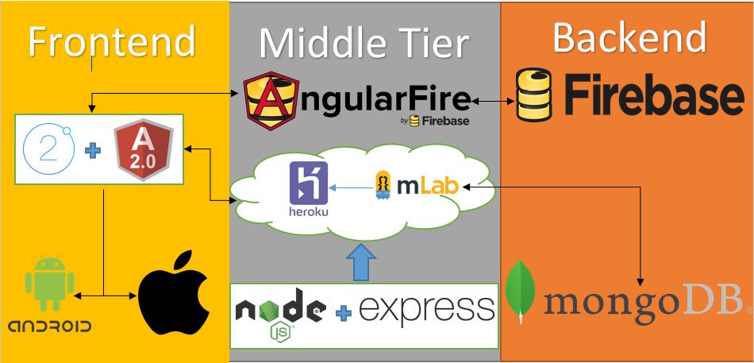

###### This project was worked on By Alan Murphy (G00312295) and Jason McTigue(G00312233)

# Introduction.

This is our repositroy for our final year project. It was a group project and we are created an app which uses the MEAN(MongoDB, Express.js, Angular.js and Node.js) stack with ionic 2. In the app users will be able to find events/locations near them and post a review to the app.

This app was created around the Idea of the popular "Reddit AMA" concept where users on reddit can go on to a form with a popular celebrity or figure (Like  [Barack Obama](https://www.reddit.com/r/IAmA/comments/z1c9z/i_am_barack_obama_president_of_the_united_states/?sort=top)!!) and literally ask them anything. We thought that this would be a good concept to bring to your local area with your local bussineses and organised events. It allows users to get more information for events they might not know much about and if they can't find the event page on facbook or twitter they can create there own in the app, ask questions/post info or reviews and get other people to contribute to the form like topic page.

## Features of the App

1. **User Authentication Using Firebase, Facebook and Twitter**

When a user opens the app they will be immeditaly greeted with a login screen for the app. From here the user can log in Using the online Firebase database we have set up for secure authentiction without social intergration, with facebook by allowing permission for the app on their facebook profile and with twitter for allowing the app permisions on thier tiwtter application. The User can also log in with an existing account created for the app and if they forgot their password with a reset password feature which will email them a password reset link.

2. **Google Map features**

As soon as the user is logged in and once they allow the app to have acces to there current location they will be greeted by a google maps interface which they can look through for events/locations in which they might be interessted in. Once a location or event is selected they can go to the review page for it.

3. **The Review Page**

On the review page the user can create reviews, ask questions or just make general comments about the location/event related to it. They must enter a description and a title by tapping the + icon on the top left corner of the app. They can also swipe a review to the left to delete a review.

## Architecture



___

# Compiling, Deploying and Running this Application.

To be able to install and run our app on your local maching follow the following steps.

## Steps for Running on a local machine.

1. **Install MongoDB on your machine and Start it.**

You can follow this [link](https://docs.mongodb.com/manual/installation/) to learn how to install and run MongoDB if you're new to the technology. If not you can just start running Mongo on your machine in the cammand line by running Monogd.exe and then in a new command line run mongo.exe.

2. **Install Node.js on your machine**

You can follow this [link](https://nodejs.org/en/) to download and install node on your machine. You need to have Node 6 or higher to run this application.

3. **Install Ionic on your machine.**

You can follow this [link](https://ionicframework.com/docs/intro/installation/) to learn how to install the ionic framework on        your machine. If you already have it installed then you should check if you're up to date with ionic 2. You can do this by runnning the following command...

```
>ionic info
```
Check the Ionic App lib version and it should be at least 2.0.0 to run this app.

4. **Clone this repository or download the .zip**

When you have the project files on your machine open the command line and navigate to the project directory. Make sure you are in the ReviewApp repositroy and run 
```
>npm install
```
This will install all the necessary node packages needed to run this application.

5. **Running the Application**

With MongoDB running and with all the above necessary instalations completed, navigate to the project folder, cd into the server folder and run this command...
```
>node server.js
```
This will start the server for our API. Now open and new command line window and cd into the ReviewApp folder and run...
```
>ionic serve -l
```
This will deploy our app on our machine in Ionic Labs where we can view how the app looks on Android, IOS and Windows. From here you can start using the app.

## How to Deploy the App on your Smart Phone.

To use this app on your smart phone device download the .apk file included in this repository and put the file on your phone. Install the .apk on your device and the app will then be installed on your phone. This app is built for Android and IOS.


